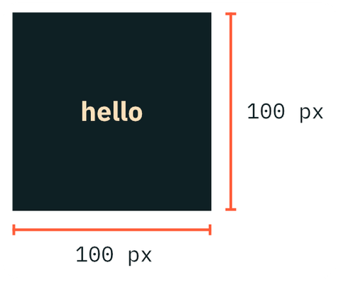
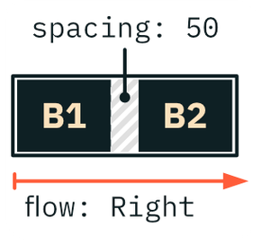

# Makepad Widgets

Makepad’s main widget crate stacking on top of Makepad Draw.

It contains:

- a retained mode widget system designable from the DSL
- a set of base widgets (buttons, sliders, checkboxes, lists, etc.)

## Walk-through

The foundation on which all Makepad widgets are built:

- A `Window` widget to create a window
- The ability to hook the drawflow to immediate mode for drawing

Widgets draw themselves when `draw_walk` is called on them. To accomplish this, they use a mechanism identical to the one used for drawing the red rectangle shown earlier. Therefore, even though widgets draw themselves using an "immediate mode," they can still form retained mode structures that are designable from the DSL.

**Example: A window with a single button**

```rust
use makepad_widgets::*;

live_design!{
    import makepad_widgets::base::*;
    import makepad_widgets::theme_desktop_dark::*;

    App = {{App}} {
        ui: <Window>{
            my_button = <Button> {
                text: "Hello, World"
            }
        }
    }
}
...

impl MatchEvent for App {
    fn handle_actions(&mut self, _cx: &mut Cx, actions:&Actions) {
        if self.ui.button(id!(my_button)).clicked(&actions) {
            println!("CLICKED!");
        }
    }
}
...
```

In this example, `Window` inherits from `View`, which gives it the ability to add arbitrary child widgets. The root widget (`Window`) handles the incoming event stream followed by a button-query to check if it was clicked.

*Retained mode* structures reside within the `<View>{}` widget, which is a component that can have a DSL-defined set of child widgets. All child widgets implement the `dyn` trait, and can be named and queried on the widget-tree.

Makepad's UI DSL does not rely on a single, giant interpreter. Instead, it is defined per widget. Therefore, every widget can determine its own rendering model, whether it be immediate mode, retained mode, or often a mixture of both.

This makes a *polling architecture* of the event flow possible. In this example the root widget `Window` handles the incoming event stream, and then the button is queried to check if it was clicked. This model enables a polling architecture for the event flow, which allows for closure and borrow-free event handling as opposed to what using a callback closure would impose.“

## Queries

For the main event handling part of the application, we implement `MatchEvent`, which is a trait to splice out events for us to handle. In this case we have the `Button` widget defined in the DSL called `my_button`. We obtain a reference to the widget and check if it has been clicked.

The `self.ui.button(id!(my_button))` call queries the UI structure which then returns a `ButtonRef` type. Almost all widgets in Makepad are derived from `Widget`, which contains the `WidgetSet` and `WidgetRef` references. Correspondingly, for each button, there is a `ButtonRef` and `ButtonSet` type that wraps a nullable reference to one or more buttons.

`ButtonSet` is used to hold all the button instances in the UI structure. It allows queries on multiple buttons at once, so only a single event handler is required. For instance `self.ui.button_set(ids!(my_button))` would return all buttons called `my_button`.

`ButtonRef` is a reference-counted pointer to the button widget. It allows queries on multiple buttons. This is particularly useful for multi-device UIs.

Once the `clicked()` action is detected, we will print out the text "CLICKED!" on the console.

## Using the turtle for layout

All widgets are laid out using the same turtle, as they are drawn using the same immediate mode drawflow.

For instance a button can be laid out like this:

```rust
my_button = <Button>{
	width: 100,
    height: 100,
	text: "hello"
}
```



The `width` and `height` properties define a fixed-size `button`, with a height and width of 100px each.

---

```rust
my_button = <Button> {
	width: Fit,
	text: "hello"
}
```


Setting the `button` dimensions to `Fit` like this, makes the container snap to the `text` text’s dimensions.

---

Similarly many UI components with child nodes follow this model.

```rust
<View> {
	flow: Right,
    spacing: 50,
	<Button> { text: "B1" },
	<Button> { text: "B2" }
}
```



The layout model is inside the immediate mode structure. Therefore it works regardless of whether widgets use retained mode or a pure immediate mode with a hookpoint.

## States and animation

Many widgets use an `Animator` object to handle state animations.

**Example** Creating a `hover` state for a single `draw_bg` shader.

```rust
Live_design!{

    Button= {{Button}} {
       draw_bg: {
            instance hover: 0.0
            fn pixel(self) -> vec4 { return mix(#f00, #0f0, self.hover) }
        }
        animator: {
            hover = {
                default: off,
                off = {
                    from: {all: Forward {duration: 0.1}}
                    apply: {
                        draw_bg: {hover: 0.0}
                    }
                }

                on = {
                    from: {all: Forward {duration: 0.1}}
                    apply: {
                        draw_bg: {hover: 1.0}
                    }
                }
            }
         }
     }
}

#[derive(Live)]
pub struct Button {
    #[animator] animator: Animator,
    …
}

impl Button {
    pub fn handle_event_with(&mut self, cx: &mut Cx, event: &Event, dispatch_action: &mut dyn FnMut(&mut Cx, ButtonAction)) {
        self.state_handle_event(cx, event);
        match event.hits(cx, self.draw_bg.area()) {
            Hit::FingerHoverIn(_) => {
                self.animate_state(cx, id!(hover.on));
            },
            …
```

This example contains the code needed to animate to the `hover.on` state when a mouse hover occurs.

The state and animation system uses the information provided by the shader-compiler to know where to write the hover value in existing draw structures.

So this way of handling user interaction

- does not require a regenerate or redraw of the UI data
- can run entirely inside a `MouseMove` event
- does not require the system to emit a `Draw` event

However, the system can also be instructed to call `redraw` to animate properties that require a real redraw i. e. when animating or changing the `walk` or `layout` properties.
